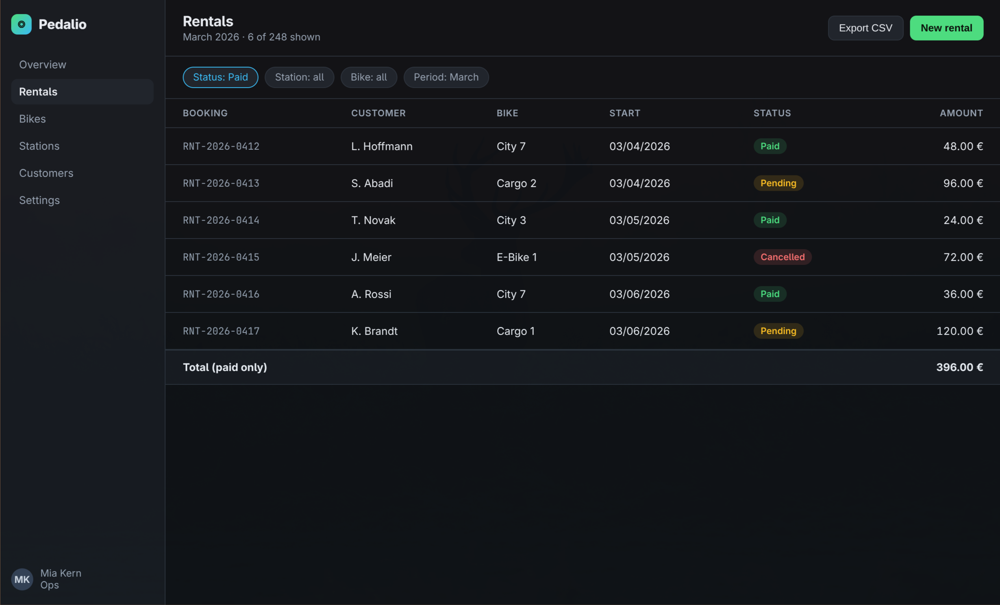
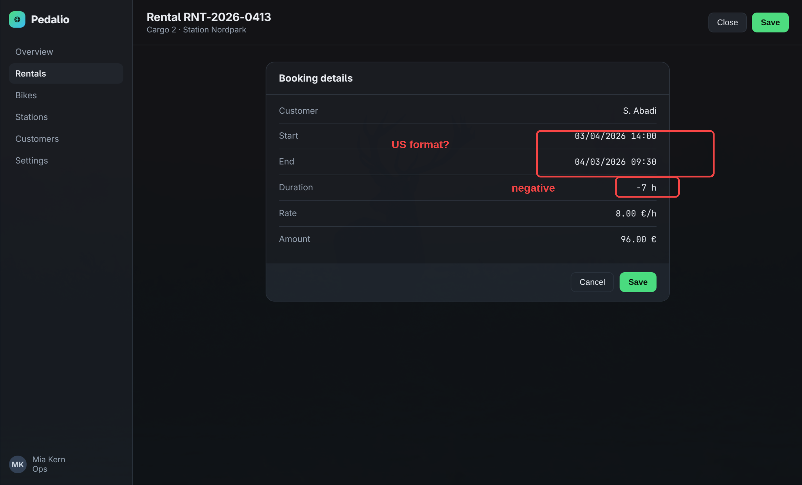
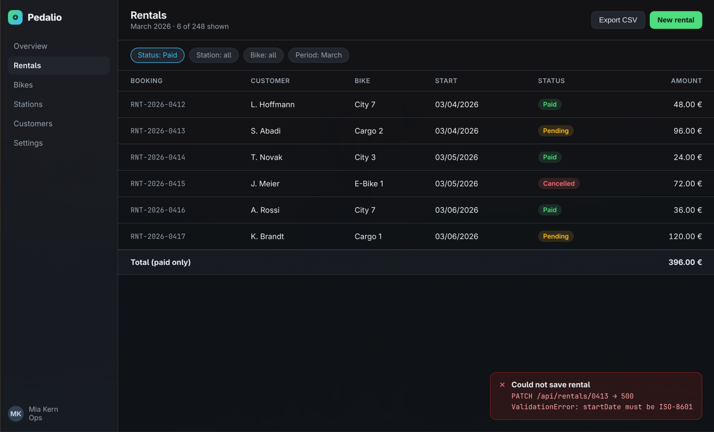
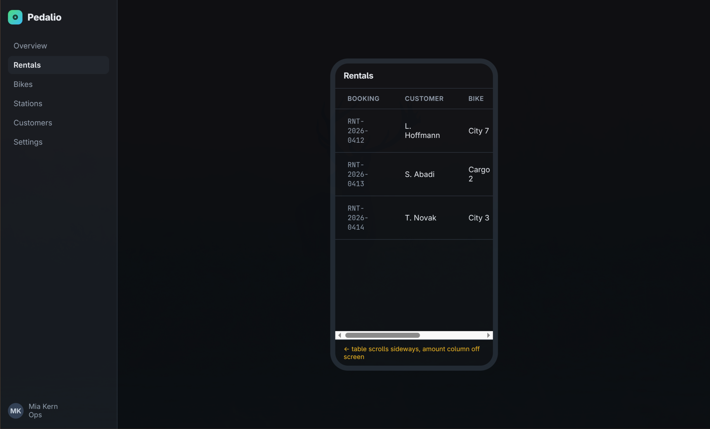

# Screenshot-Session: Pedalio rentals

Aufgenommen am 31.08.2026 um 16:17. 4 Screenshots mit Kommentar.

Die PNG-Dateien liegen im selben Verzeichnis wie diese Datei. Die Reihenfolge der Abschnitte ist die Reihenfolge der Bedienschritte. Oeffne ein Bild, wenn der Kommentar allein nicht reicht.

## 1. Filter says Status: Paid, but pending and cancelled rentals are sti...

- Datei: `01-filter-says-status-paid-but-pending-and.png`
- Ausschnitt: 1588x962 px (Bild: 2540x1539 px)
- Fenster: chromium: "Pedalio — Rental Dashboard"
- Zeit: 16:17:17

Kommentar:

> Filter says Status: Paid, but pending and cancelled rentals are still listed. Total only sums the paid ones, so list and total disagree.

## 2. Dates render as MM/DD/YYYY. End date is before start date and durat...

- Datei: `02-dates-render-as-mm-dd-yyyy-end-date-is-b.png`
- Ausschnitt: 1588x962 px (Bild: 2540x1539 px)
- Fenster: chromium: "Pedalio — Rental Dashboard"
- Im Bild markiert: die Hervorhebungen gehoeren zum Kommentar
- Zeit: 16:17:20

Kommentar:

> Dates render as MM/DD/YYYY. End date is before start date and duration shows -7 h.

## 3. Saving a pending rental fails: PATCH /api/rentals/0413 returns 500,...

- Datei: `03-saving-a-pending-rental-fails-patch-api.png`
- Ausschnitt: 1588x962 px (Bild: 2540x1539 px)
- Fenster: chromium: "Pedalio — Rental Dashboard"
- Zeit: 16:17:23

Kommentar:

> Saving a pending rental fails: PATCH /api/rentals/0413 returns 500, ValidationError on startDate.

## 4. On narrow screens the amount column is pushed off screen and nothin...

- Datei: `04-on-narrow-screens-the-amount-column-is-p.png`
- Ausschnitt: 1588x962 px (Bild: 2540x1539 px)
- Fenster: chromium: "Pedalio — Rental Dashboard"
- Zeit: 16:17:26

Kommentar:

> On narrow screens the amount column is pushed off screen and nothing hints that the table scrolls.
