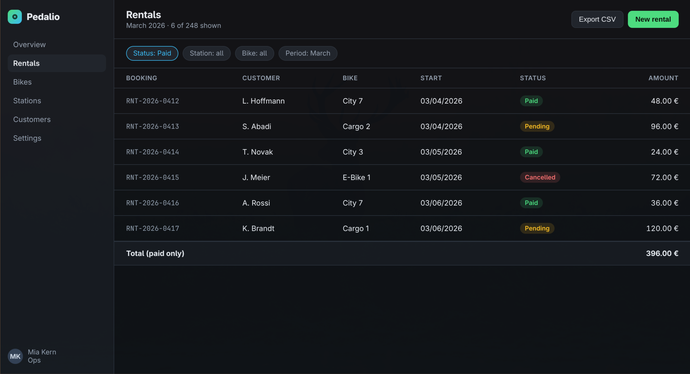
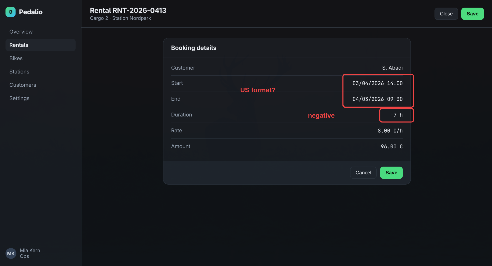
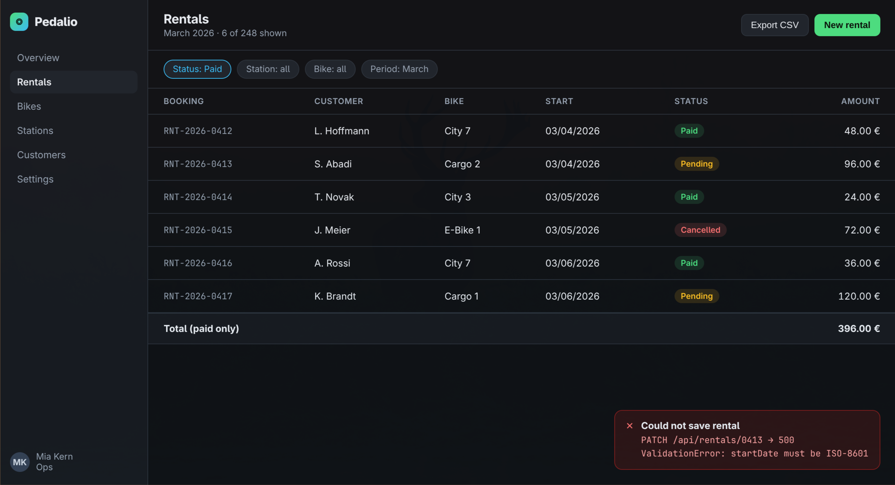
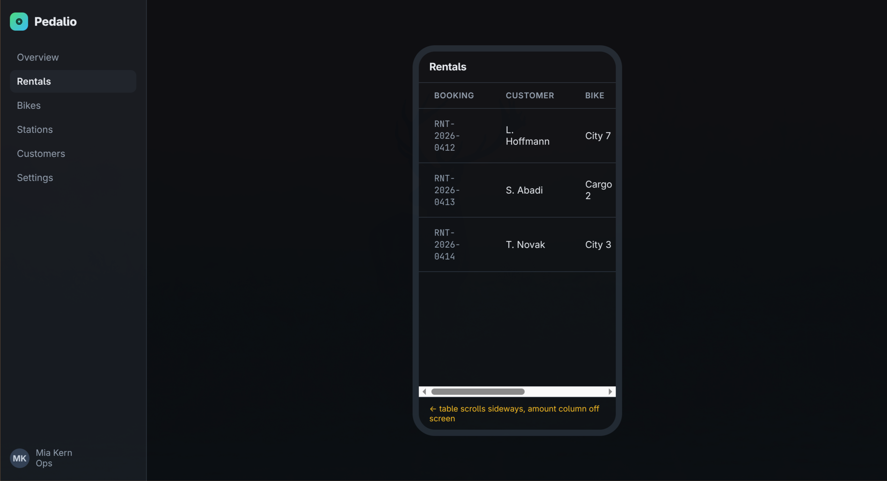

# Screenshot walkthrough: Pedalio rentals

Captured on 01 September 2026 at 08:25. 4 commented screenshots.

The PNG files sit in the same directory as this file. The order of the sections is the order the steps were taken in. Open an image when the comment alone is not enough.

## 1. Filter says Status: Paid, but pending and cancelled rentals are sti...

- File: `01-filter-says-status-paid-but-pending-and.png`
- Region: 1588x862 px (image: 2540x1379 px)
- Window: chromium: "Pedalio — Rental Dashboard"
- Time: 08:25:19

Comment:

> Filter says Status: Paid, but pending and cancelled rentals are still listed. Total only sums the paid ones, so list and total disagree.

## 2. Dates render as MM/DD/YYYY. End date is before start date and durat...

- File: `02-dates-render-as-mm-dd-yyyy-end-date-is-b.png`
- Region: 1588x862 px (image: 2540x1379 px)
- Window: chromium: "Pedalio — Rental Dashboard"
- Annotated: the highlights are part of the comment
- Time: 08:25:22

Comment:

> Dates render as MM/DD/YYYY. End date is before start date and duration shows -7 h.

## 3. Saving a pending rental fails: PATCH /api/rentals/0413 returns 500,...

- File: `03-saving-a-pending-rental-fails-patch-api.png`
- Region: 1588x862 px (image: 2540x1379 px)
- Window: chromium: "Pedalio — Rental Dashboard"
- Time: 08:25:24

Comment:

> Saving a pending rental fails: PATCH /api/rentals/0413 returns 500, ValidationError on startDate.

## 4. On narrow screens the amount column is pushed off screen and nothin...

- File: `04-on-narrow-screens-the-amount-column-is-p.png`
- Region: 1588x862 px (image: 2540x1379 px)
- Window: chromium: "Pedalio — Rental Dashboard"
- Time: 08:25:27

Comment:

> On narrow screens the amount column is pushed off screen and nothing hints that the table scrolls.
